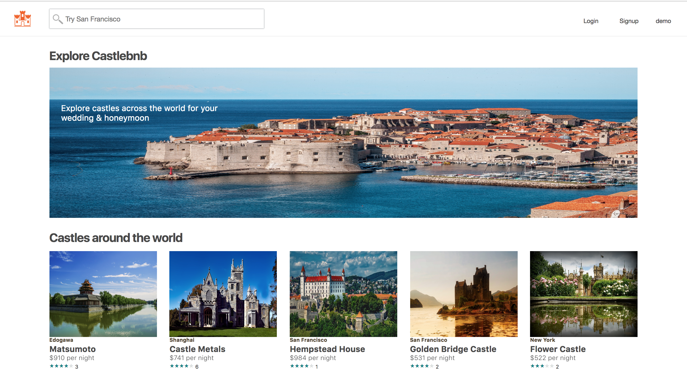
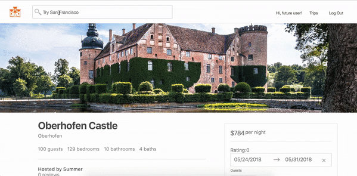
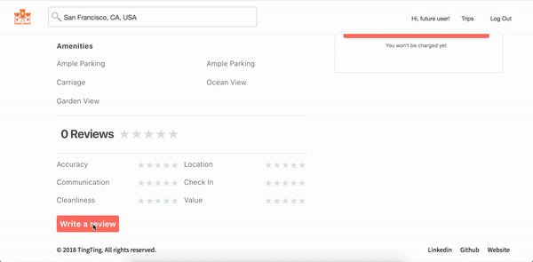
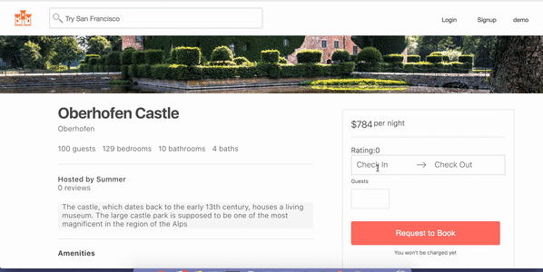

# Castlebnb

[Castlebnb Live](https://castlebnb.herokuapp.com/#/)

Castlebnb is a full-stack, single-page application inspired by Airbnb used for booking luxury castles for wedding events. Castlebnb was built using a PostgreSQL database, a Ruby on Rails backend and React/Redux on the front-end. It features castles that users can view, book and review.  Users can search for homes by location through the search bar or by clicking on a specific home on the map.  

A guest login feature is available to check out the website without going through the signup process.

**Features**

Users begin at the home page where they can view homes whether they are logged in or not.  Buttons in the top right corner open modals that allow the user to login or signup.  A guest login option is available for demonstration. Users can explore homes by scrolling through them on the homepages, typing a location to search in the search bar or clicking on the buttons that link to pre-selected locations. Search results are presented in the search page, and their locations are rendered on the Google Map. Users are able to click on markers on the Google Map to identify specific castles.

 At any time, the user can click the logo in the top left corner to navigate to the homepage.Upon entering the site, the app immediately queries the database to pull the selected 12 picks and render them to the page. Otherwise, the database renders dynamically depending on which page you're viewing.

Castles have methods that allow them to carry reviews metadata: the average review rating and the number of reviews. When a user enters the show page and the app makes a request to the database, the database returns both the castle and the castle's reviews in one castle object. This enables the app to avoid querying multiple times.
Review form utilizes React star rating component that creates clean and perfect look, achieving smooth and interactive user interface.

The booking form itself was modeled after Airbnb's booking form. Since the user data is stored globally, users can leave this section and come back without losing their data. The form validates users' credential and will redirect user to log-in page if user was not logged in. It also validates overlapping dates and max guest numbers. Error messages will be rendered if validation fails. Upon success submission, a drop-down list will pop up automatically under navigation bar containing all booking records.

**Future Directions for the Project**

In addition to the features already implemented, I plan to continue work on this project. The next steps for HairBNB are outlined below.

- Profiles
  - user can interact with other users to exchange information
  - hosts are able to approve reservations
